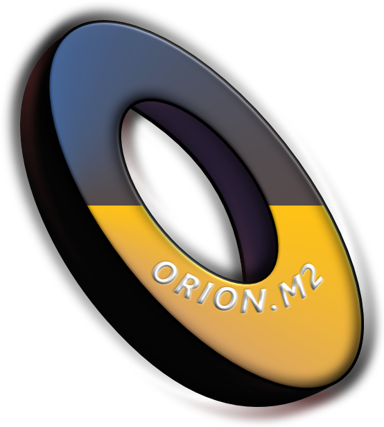

# ORION.M2

  

ORION.M2 ia a target demo system that I use to test connector logic with persons and permissions.

## Prerequisites

- [ ] .NET 6.0 https://dotnet.microsoft.com/en-us/download/dotnet/6.0

## Implemented endpoints and HTTP methods

| Method | Endpoint | Description               |
| ------ | -------- | ------------------------- |
| GET    | /api/Permission      | Retrieve all permissions   |
| POST   | /api/Permission      | Create new permission      |
| GET    | /api/Permission/{id} | Get a permission by `id`   |
| PATCH  | /api/Permission/{id} | Update a permission by `id`|
| DELETE | /api/Permission/{id} | Delete a permission by `id`|
| GET    | /api/Person          | Retrieve all persons       |
| POST   | /api/Person          | Create a new person          |
| GET    | /api/Person/{id}     | Get a person by `id`       |
| PATCH  | /api/Person/{id}     | Update a person by `id`    |
| DELETE | /api/Person/{id}     | Delete a person by `id`    |
| POST   | /api/Person/createSamplePersons | Creates new persons in the ORION.M2 database using the bogus nuget library |
| DELETE | /api/Person/all    | Removes all persons (both sample and non-sample from the database)    |

## `Locale` parameter for creating sample persons in the ORION.M2 database

When creating sample persons using a `HTTP POST` to: `/api/Person/createSamplePersons` a locale is required.
For a complete overview of locales see: https://github.com/bchavez/Bogus

## Swagger interface

The API comes with a swagger interface so that you can easily test the API.